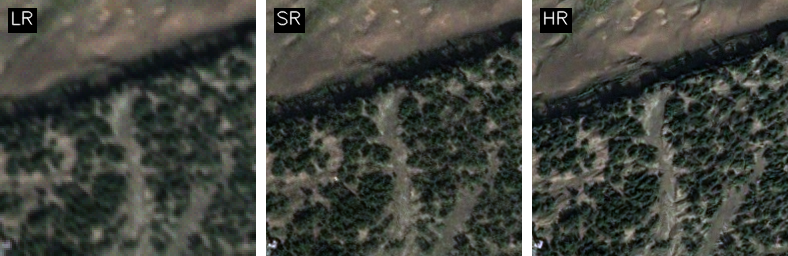
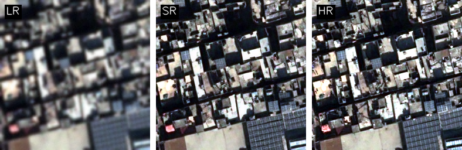
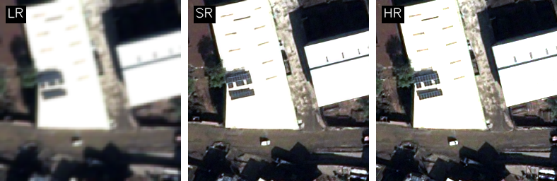
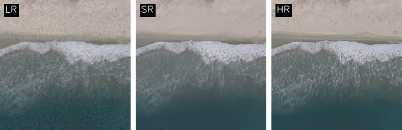
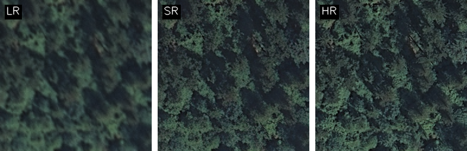
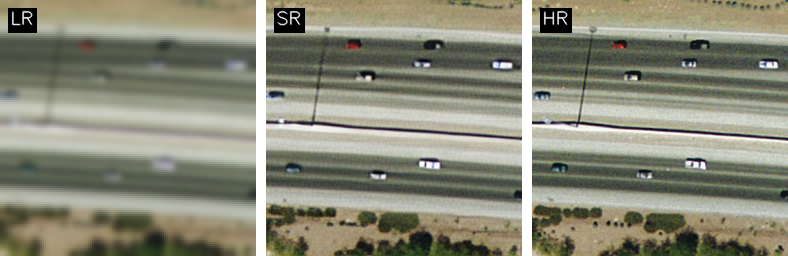
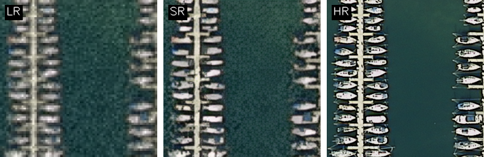

# SwinIR — Remote-Sensing Super-Resolution

This repository contains training, testing, and preprocessing code for **SwinIR** (Swin Transformer–based Image Restoration), adapted for **remote-sensing satellite imagery super-resolution** on Pleiades and related datasets.

The codebase is built on the [KAIR framework](https://github.com/cszn/KAIR) by Kai Zhang (ETH Zurich) and the original [SwinIR implementation](https://github.com/JingyunLiang/SwinIR) by Jingyun Liang et al.

---

## What This Repository Does

- **Preprocesses** paired HR/LR Pleiades satellite imagery into patch datasets ready for SR training.
- **Trains** SwinIR models with either PSNR-optimised (L1) or GAN-based (perceptual) losses, on single or multiple GPUs.
- **Tests** trained models against held-out imagery, reporting 8 image quality metrics: PSNR, SSIM, IT-SSIM, SAM, UIQI, RMSE, FSIM, SRER.
- **Evaluates** results class-wise for UCMerced-style datasets.
- **Generates** side-by-side visual comparisons of LR / SR / HR image patches.

---

## Repository Structure

```
KAIR/
├── main_train_swinir.py          # PSNR training
├── main_train_swinir_gan.py      # GAN training
├── main_test_swinir_config.py    # Batch inference + 8 metrics (pre-patched images)
├── raw_inference.py              # End-to-end inference on raw full-size satellite images
├── main_evaluate_swinir_by_class.py  # Class-wise evaluation
├── compare_images_side_by_side.py    # Visual comparisons
├── models/
│   └── network_swinir.py         # SwinIR architecture
├── data/
│   ├── dataset_sr.py             # SR dataset (classical / bicubic)
│   └── dataset_blindsr.py        # Blind SR (BSRGAN degradation on the fly)
├── options/swinir/               # JSON training configs
├── pleaides_preprocessing/       # Satellite data preprocessing pipeline
│   ├── pipeline3.py              # Main preprocessing pipeline
│   ├── verify_coregistration.py  # HR/LR alignment diagnostics
│   ├── esrgan_mapping_optuna.py  # Learn satellite degradation model
│   └── apply_esrgan_degradation.py  # Apply learned degradation
├── superresolution/              # Training outputs (checkpoints, logs, images)
├── trainsets/                    # Training data
└── testsets/                     # Test data
```
---

## Web GUI (KAIR Super-Resolution Studio)

A unified Web GUI is available for preprocessing satellite datasets, training SwinIR models (both PSNR and GAN versions), running inference, and monitoring training metrics/logs in real time.

For installation and running instructions, see [gui/GUI_USAGE.md](gui/GUI_USAGE.md).

---

## Quick Start

### 1. Preprocess satellite imagery
```bash
# Pass a JSON config file (recommended), or edit CONFIG directly in the script:
python pleaides_preprocessing/pipeline3.py --config path/to/config.json
```

### 2. Train (PSNR)
```bash
python main_train_swinir.py --opt options/swinir/train_swinir_sr_classical.json
```

### 3. Train (GAN)
```bash
python main_train_swinir_gan.py --opt options/swinir/train_swinir_sr_realworld_x2_gan.json
```

### 4. Test (pre-patched images)
```bash
# Edit CONFIG and MODEL_CONFIG in the script with model path and dataset dirs, then run:
python main_test_swinir_config.py
```

### 5. Raw inference on full satellite images
```bash
# Paired mode — LR + HR, runs full coregistration and computes metrics:
python raw_inference.py --config config.json

# LR-only mode — no ground truth required:
python raw_inference.py --config config_lr_only.json
```

For full configuration details see [USAGE.md](USAGE.md).

---

## Metrics

All test and evaluation scripts report the following metrics against HR ground truth:

| Metric | Measures |
|--------|---------|
| PSNR | Peak signal-to-noise ratio (higher is better) |
| SSIM | Structural similarity (higher is better) |
| IT-SSIM | Information-theoretic SSIM variant |
| SAM | Spectral angle mapper (lower is better) |
| UIQI | Universal image quality index |
| RMSE | Root mean square error (lower is better) |
| FSIM | Feature similarity index |
| SRER | Signal-to-reconstruction error ratio |

---

## Results

Quantitative evaluation of SwinIR (2× upscaling) on 3 test datasets. Benchmark ranges indicate acceptable performance for satellite imagery SR.

| # | Metric | Benchmark / Acceptable Range | Sen2Venus (2×) | UCMerced (2×) | XView (2×) |
|---|--------|-----------------------------|---------------|---------------|------------|
| 1 | PSNR (dB) ↑ | > 35 dB | 32.82         | 27.69 | 30.42 |
| 2 | SSIM ↑ | 0.85 – 0.95 | 0.9234        | 0.7570 | 0.7820 |
| 3 | IT-SSIM ↑ | ≥ 0.95 | 0.9234        | 0.7570 | 0.7820 |
| 4 | SAM (°) ↓ | < 3° | 2.45          | 1.7425 | 1.7332 |
| 5 | UIQI ↑ | ≈ 1.00 | 0.9740        | 0.9283 | 0.9346 |
| 6 | FSIM ↑ | 0.90 – 0.95 | 0.9560        | 0.8745 | 0.8757 |
| 7 | RMSE ↓ | 12 – 20 (8-bit) | 6.257         | 12.2935 | 9.0001 |
| 8 | SRER (dB) ↑ | 20 – 25 dB | 21.03         | 21.5180 | 18.95 |

> **Note:** Results reflect inference on held-out test sets using the trained checkpoint.

---

## Visual Comparisons

Each image shows **LR | SR | HR** left to right.









---

## Reference

```bibtex
@inproceedings{liang2021swinir,
  title={SwinIR: Image Restoration Using Swin Transformer},
  author={Liang, Jingyun and Cao, Jiezhang and Sun, Guolei and Zhang, Kai and Van Gool, Luc and Timofte, Radu},
  booktitle={IEEE International Conference on Computer Vision Workshops},
  pages={1833--1844},
  year={2021}
}
```
