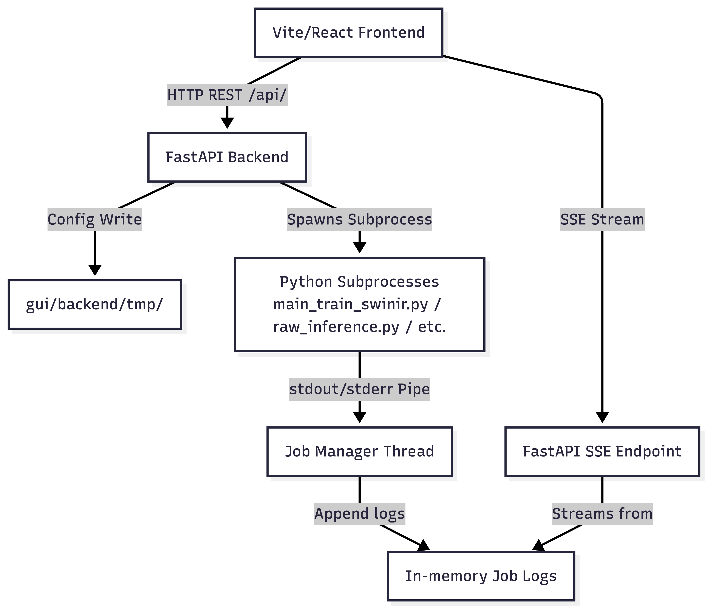

# KAIR Super-Resolution Studio — Technical Specification

This document provides a detailed technical specification of the KAIR Super-Resolution Studio GUI, covering the frontend stack, backend service layer, long-running job manager subprocess logic, code layouts, and the API endpoints.

For instructions on environment setup, dependencies installation, and launching the application, see [GUI_USAGE.md](GUI_USAGE.md).

---

## 1. System Architecture

The KAIR Super-Resolution Studio GUI is structured as a decoupled web application with a FastAPI backend that acts as a wrapper around original KAIR Python training, preprocessing, and inference scripts:




---

## 2. Frontend Stack & Architecture

### Technology Stack
- **Framework & Build Tool**: React v18.3.1 bootstrapped with Vite v5.4.21.
- **Styling**: Tailwind CSS v4.3.0 for responsive and modern interface styling.
- **Routing**: React Router DOM v6.30.4.
- **HTTP Client**: Axios v1.17.0.
- **Image Comparison**: `react-compare-image` v3.5.17 for interactive side-by-side composite comparison slider.

### Core Frontend Components & Pages
- **Pages**:
  - **Training (`/training`)**: Allows configuring SwinIR PSNR and GAN training configs, loading presets from `options/swinir/`, and inspecting runs.
  - **Inference (`/inference`)**:
    - *Tab 1 (Patched)*: Direct folder batch inference with PSNR/SSIM and satellite metric calculations.
    - *Tab 2 (Raw Paired)*: Coregisters LR and HR satellite images, performs scaling, stitches with Hann-window blend, and displays composites and per-band grids.
    - *Tab 3 (LR-Only)*: Same as Tab 2 but without HR ground truth comparisons.
  - **Preprocessing (`/preprocessing`)**:
    - *Tab A (Pleiades)*: Coregistration (ORB + Phase Correlation + ECC), radiometric scaling, and sliding-patch export.
    - *Tab B (HR Degradation)*: Synthetic degradation options (MTF satellite, BSRGAN, Real-ESRGAN).
    - *Tab C (Step Preview)*: Displays real-time pipeline image previews emitted during processing.
- **Reusable Field Wrappers**: `SelectField`, `TextField`, `NumberField`, `BoolToggle`, `ArrayEditor`, and `CollapsibleSection` inside [FormFields.jsx](file:///Users/Hassaan/PycharmProjects/KAIR/gui/frontend/src/components/FormFields.jsx).
- **Log Panel**: [LogConsole.jsx](file:///Users/Hassaan/PycharmProjects/KAIR/gui/frontend/src/components/LogConsole.jsx) displays real-time log outputs with ansi-color styling and scroll lock.

### SSE Client Logging
Real-time stdout/stderr log output from active subprocesses is streamed via Server-Sent Events (SSE) using the HTML5 `EventSource` API wrapper in [client.js](file:///Users/Hassaan/PycharmProjects/KAIR/gui/frontend/src/api/client.js):
```javascript
export function openLogStream(domain, jobId, onLine, onStatus) {
  const es = new EventSource(`/api/${domain}/stream/${jobId}`)
  es.onmessage = (e) => onLine(e.data)
  es.addEventListener('status', (e) => {
    onStatus(e.data)
    es.close()
  })
  ...
}
```

---

## 3. Backend Stack & Architecture

### Technology Stack
- **Web Framework**: FastAPI v0.111.0.
- **ASGI Server**: Uvicorn v0.29.0.
- **Data Validation**: Pydantic v2.7.0.
- **Async File IO**: `aiofiles` v23.2.1.
- **Form Parsing**: `python-multipart` v0.0.9.

### Subprocess Job Manager (`job_manager.py`)
To prevent blocks on the main Uvicorn event loop while reading streaming output from long-running subprocesses, [job_manager.py](file:///Users/Hassaan/PycharmProjects/KAIR/gui/backend/services/job_manager.py) spawns subprocess processes using Python's `subprocess.Popen` inside `asyncio.to_thread`.
- **Log Buffer**: Stores up to 5000 lines per job in an in-memory `collections.deque` buffer.
- **Log Streaming**: SSE routes yield lines from the buffer and stream updates as they arrive, sleeping `0.3s` iteratively until the process finishes and emits a final status event (`completed`, `failed`, or `cancelled`).

### Windows Process Isolation Workaround
When running Python subprocesses on Windows, imported scientific computing libraries (like PyTorch and numpy) may hook signals globally. If the Uvicorn parent process receives signals or intercepts imports, a `KeyboardInterrupt` can abort active training/inference processes.
- **Process Group Isolation**: On Windows, the subprocess is spawned using `creationflags=subprocess.CREATE_NEW_PROCESS_GROUP`.
- **Subprocess Cancellation**: Standard Unix `SIGTERM` signals do not exist/behave differently on Windows. For Windows, cancellation signals are mapped to `signal.CTRL_BREAK_EVENT`:
  ```python
  if sys.platform == "win32":
      os.kill(job.process.pid, signal.CTRL_BREAK_EVENT)
  else:
      os.kill(job.process.pid, signal.SIGTERM)
  ```

---

## 4. Python Subprocess Mappings

The backend serves as a thin wrapper around original KAIR core Python scripts. When jobs are launched from the frontend, the FastAPI backend spawns the corresponding Python scripts under the hood:

| GUI Workspace / Functionality | FastAPI Router / Endpoint | Backend Script / Executable | Configuration Delivery |
|---|---|---|---|
| **Training (PSNR Mode)** | `/api/training/start` | [main_train_swinir.py](file:///Users/Hassaan/PycharmProjects/KAIR/main_train_swinir.py) | Passed via `--opt` (temporary JSON written to `gui/backend/tmp/train_{task}.json`). |
| **Training (GAN Mode)** | `/api/training/start` | [main_train_swinir_gan.py](file:///Users/Hassaan/PycharmProjects/KAIR/main_train_swinir_gan.py) | Passed via `--opt` (temporary JSON written to `gui/backend/tmp/train_{task}.json`). |
| **Inference (Tab 1: Patched)** | `/api/inference/start` | [main_test_swinir_config.py](file:///Users/Hassaan/PycharmProjects/KAIR/main_test_swinir_config.py) | Imported and wrapped in a dynamic python script under `gui/backend/tmp/run_inference.py` to inject `CONFIG` and `MODEL_CONFIG` dictionaries. |
| **Inference (Tab 2: Raw Paired)** | `/api/inference/raw-paired/start` | [raw_inference.py](file:///Users/Hassaan/PycharmProjects/KAIR/raw_inference.py) | Run with `mode=paired` using `--config` pointing to temporary JSON. |
| **Inference (Tab 3: LR-Only)** | `/api/inference/lr-only/start` | [raw_inference.py](file:///Users/Hassaan/PycharmProjects/KAIR/raw_inference.py) | Run with `mode=lr_only` using `--config` pointing to temporary JSON. |
| **Preprocessing (Tab A: Pleiades)** | `/api/preprocessing/pipeline3/start` | [pleaides_preprocessing/pipeline3.py](file:///Users/Hassaan/PycharmProjects/KAIR/pleaides_preprocessing/pipeline3.py) | Passed via `--config` pointing to temporary config JSON. |
| **Preprocessing (Tab B: Degradation)** | `/api/preprocessing/run-pipeline/start` | [preprocessing_pipeline/run_pipeline.py](file:///Users/Hassaan/PycharmProjects/KAIR/preprocessing_pipeline/run_pipeline.py) | Passed via `--config` pointing to temporary config JSON. |

---

## 5. Technical File Locations Map

| Path | Purpose / Description |
|---|---|
| [gui/backend/main.py](file:///Users/Hassaan/PycharmProjects/KAIR/gui/backend/main.py) | App entry point; handles CORS and mounts built frontend dist folder in production. |
| [gui/backend/routers/](file:///Users/Hassaan/PycharmProjects/KAIR/gui/backend/routers/) | API Route handlers. Includes `training.py`, `inference.py`, and `preprocessing.py`. |
| [gui/backend/services/job_manager.py](file:///Users/Hassaan/PycharmProjects/KAIR/gui/backend/services/job_manager.py) | Manages long-running subprocesses, log polling/buffers, and process group signal overrides. |
| [gui/backend/services/config_service.py](file:///Users/Hassaan/PycharmProjects/KAIR/gui/backend/services/config_service.py) | Reads/writes model configurations and Optuna-optimized degradation json configurations. |
| [gui/backend/schemas/](file:///Users/Hassaan/PycharmProjects/KAIR/gui/backend/schemas/) | Pydantic data schemas representing API request/response payloads. |
| [gui/backend/tmp/](file:///Users/Hassaan/PycharmProjects/KAIR/gui/backend/tmp/) | Directory where temporary pipeline/training configurations are stored before launch. |
| [gui/frontend/src/pages/](file:///Users/Hassaan/PycharmProjects/KAIR/gui/frontend/src/pages/) | Main view components: `Training.jsx`, `Inference.jsx`, `Preprocessing.jsx`. |
| [gui/frontend/src/components/](file:///Users/Hassaan/PycharmProjects/KAIR/gui/frontend/src/components/) | Form wrapper controls (`FormFields.jsx`) and log visualizers (`LogConsole.jsx`). |
| [gui/frontend/src/api/client.js](file:///Users/Hassaan/PycharmProjects/KAIR/gui/frontend/src/api/client.js) | Axios API client configurations and SSE connection listener helper. |

---

## 6. API Reference

Interactive OpenAPI documentation is auto-served at `http://localhost:8000/docs`.

### System Health
- **`GET /api/health`** — Simple health probe returning backend and server status.

### Training Routes
- **`GET /api/training/configs`** — Scans `options/swinir/` for JSON configuration files.
- **`GET /api/training/config/{name}`** — Loads specific JSON config details by file name.
- **`GET /api/training/runs`** — Scans the `superresolution/` directory for active/previous training tasks.
- **`POST /api/training/start`** — Generates a temporary JSON training configuration and spawns a python training subprocess (`main_train_swinir.py` or `main_train_swinir_gan.py`).
- **`GET /api/training/stream/{job_id}`** — SSE stream for logs matching the specified training job.
- **`POST /api/training/stop/{job_id}`** — Cancels active training subprocess.

### Inference Routes
- **`GET /api/inference/tasks`** — Scans the `superresolution/` directory to retrieve trained tasks.
- **`GET /api/inference/latest-model/{task}`** — Identifies the latest model checkpoint (`.pth`) for the selected training task.
- **`GET /api/inference/config-from-options/{name}`** — Extracts SwinIR architecture parameters from standard option configs.
- **`GET /api/inference/config-from-path`** — Auto-detects model dimensions and SwinIR setup options from checkpoint directory paths.
- **`POST /api/inference/start`** — Launches standard patched image inference (`main_test_swinir_config.py`).
- **`GET /api/inference/stream/{job_id}`** — SSE stream for logs matching the specified inference job.
- **`POST /api/inference/stop/{job_id}`** — Cancels active inference subprocess.
- **`POST /api/inference/raw-paired/start`** — Launches paired raw satellite inference (`raw_inference.py` in paired mode).
- **`POST /api/inference/lr-only/start`** — Launches single LR-only satellite inference (`raw_inference.py` in single mode).
- **`GET /api/inference/raw/result/{job_id}/{filename}`** — Serves visual outputs (RGB composites or individual band grayscales) as PNGs.
- **`GET /api/inference/raw/metrics/{job_id}`** — Fetches calculated accuracy stats from `metrics.json`.
- **`GET /api/inference/image-info`** — Interrogates geospatial satellite images for channel depth, height/width dimensions, and geospatial metadata flags.

### Preprocessing Routes
- **`POST /api/preprocessing/pipeline3/start`** — Launches co-registration and patch extraction pipeline (`pipeline3.py`).
- **`POST /api/preprocessing/run-pipeline/start`** — Launches synthetic HR degradation/normalisation pipeline (`run_pipeline.py`).
- **`GET /api/preprocessing/stream/{job_id}`** — SSE stream for logs matching the specified preprocessing job.
- **`POST /api/preprocessing/stop/{job_id}`** — Cancels active preprocessing job.
